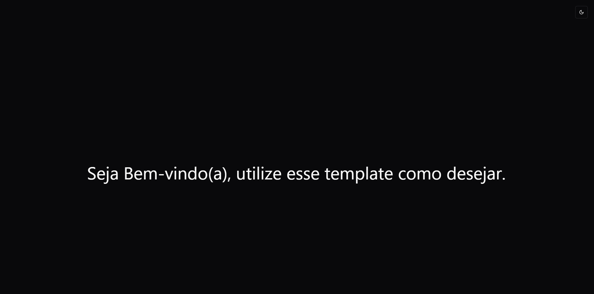
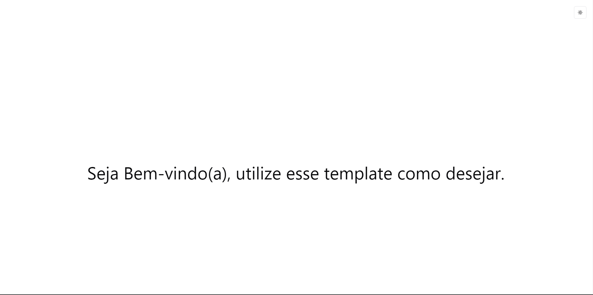

# Template React.js com TypeScript, Vite, Tailwind CSS e Shadcn/ui

Este é um template básico para iniciar um projeto usando React.js com TypeScript, Vite como bundler, e Tailwind CSS para estilos, incluindo Shadcn/ui para facilitar a criação de sombras.

## Instalação

1. Clone este repositório:

```shell
git clone https://github.com/Alessandro-filho/base-template.git
```

2. Navegue até o diretório do projeto:

```shell
cd base-template
```

3. Instale as dependências:

```shell
npm install
```
ou
```shell
yarn install
```

## Uso

Depois de instalar as dependências, você pode iniciar o servidor de desenvolvimento local:

```shell
npm run dev
```
ou
```shell
yarn dev
```


Isso iniciará um servidor local em `http://localhost:5173` por padrão, onde você poderá visualizar e trabalhar no seu aplicativo.

## Estrutura do Projeto

A estrutura do projeto é simples e segue um padrão comum para aplicativos React.js. Aqui está uma visão geral dos diretórios principais:

- `src/`: Contém todo o código-fonte do aplicativo.
  - `components/`: Componentes React reutilizáveis.
    - `custom/`: Componentes do customizados.
    - `ui/`: Componentes do [shadcn/ui](https://ui.shadcn.com/).
  - `pages/`: Páginas React que são renderizadas em diferentes rotas.
- `public/`: Contém arquivos estáticos, como imagens ou fontes.

## Temas

O template consiste em 2 temas principais, `dark` e `light`, você pode querer alterar os temas, então acesse [aqui](https://ui.shadcn.com/themes), copie o código e coloque no `index.css`.

`dark`:


`light`:


## Licença

Este projeto está licenciado sob a Licença MIT. Consulte o arquivo `LICENSE` para obter mais detalhes.
